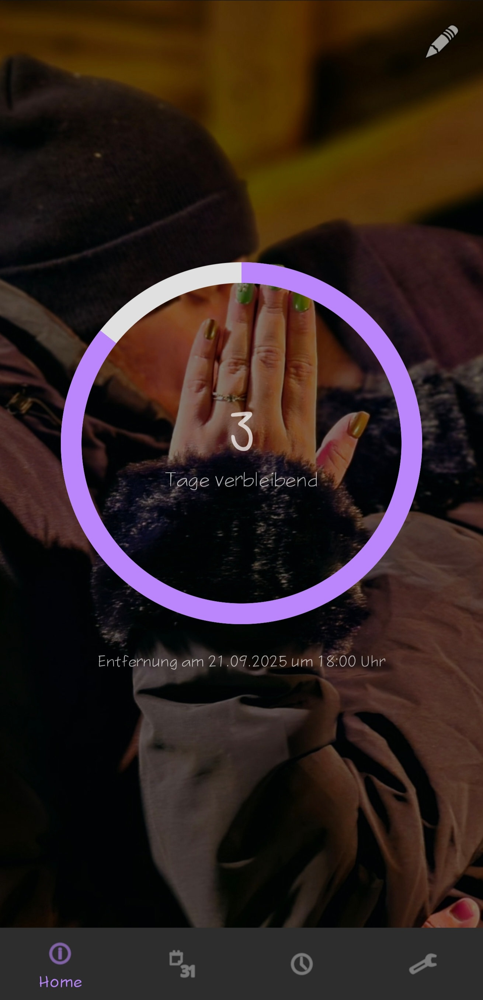
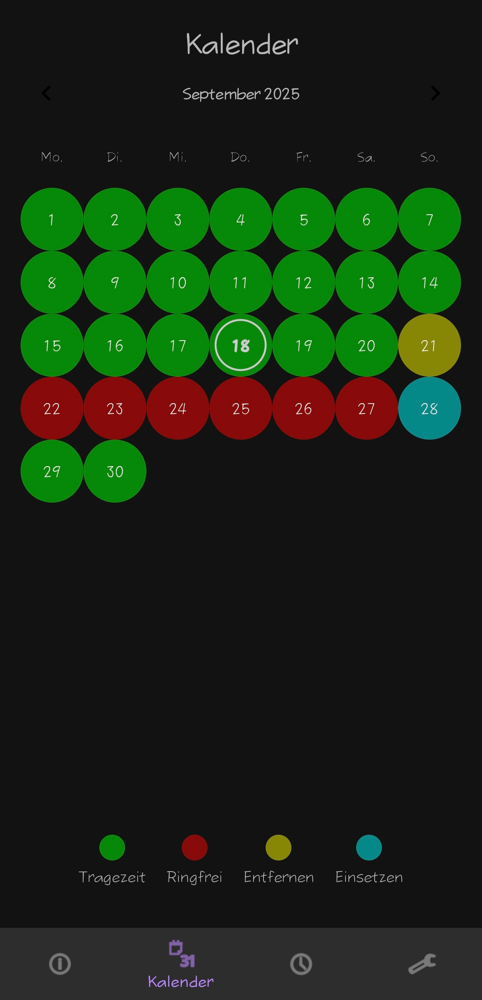
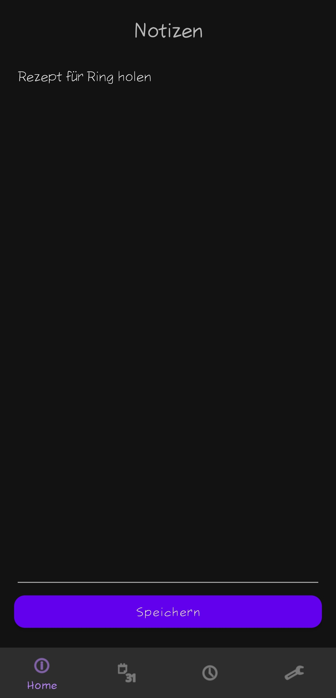
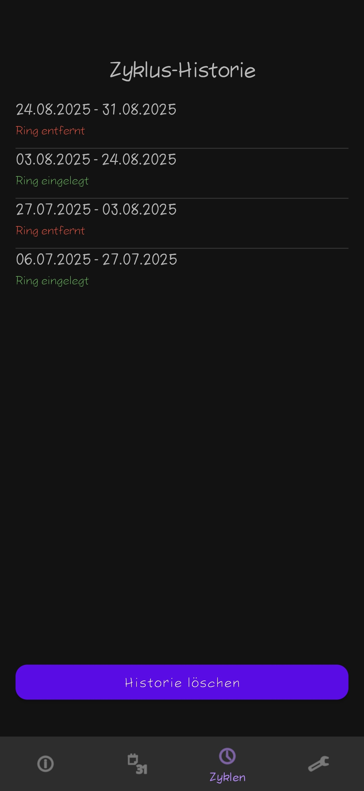
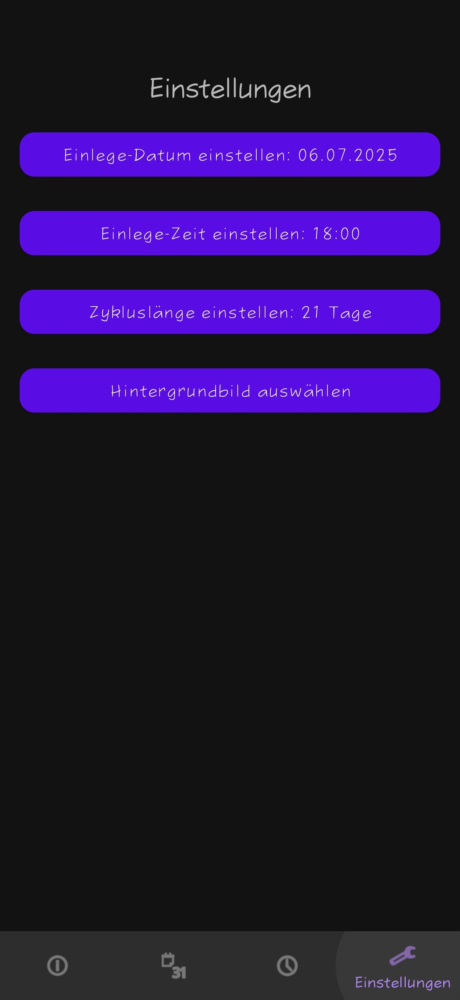

* * *

<div align="center">

📱 Veri Aristo App
============================

**An Android app for tracking and managing contraceptive ring cycles**  
📅⏰📝🎨📊

  

</div>


* * *

✨ Authors
---------

| Name | GitHub | Role | Contact | Contributions |
| --- | --- | --- | --- | --- |
| **[Daniel Sichler aka Darexsh](https://github.com/Darexsh)** | [Link](https://github.com/Darexsh?tab=repositories) | Android App Development 📱🛠️, UI/UX Design 🎨 | 📧 [E-Mail](mailto:sichler.daniel@gmail.com) | Concept, Feature Implementation, Calendar & Reminder Logic, Notes Management, UI Design |

* * *

🚀 About the Project
==============

**Veri Aristo** is an Android application designed to help users track and manage contraceptive ring cycles. The app provides a calendar-based visualization of insertion, removal, and ring-free days, along with reminders, personal notes, and customizable settings.

* * *

✨ Features
----------

* 📅 **Cycle Tracking**: Visualize insertion, removal, ring-free, and active days with color-coded calendar highlights.
    
* 🔔 **Reminders**: Receive notifications for ring insertion and removal at your preferred time.
    
* 📝 **Notes**: Add and save personal notes securely using SharedPreferences.
    
* 🎨 **Customization**: Set cycle length, start date, reminder time, and choose a custom background image.
    
* 📊 **Cycle History**: Review past and upcoming cycles to track patterns and durations.
    

* * *

📸 Screenshots
--------------

<table>
  <tr>
    <td align="center"><b>Home Screen</b><br></td>
    <td align="center"><b>Calendar</b><br></td>
    <td align="center"><b>Notes</b><br></td>
    <td align="center"><b>Cycles</b><br></td>
    <td align="center"><b>Settings</b><br></td>
  </tr>
</table>

* * *

📥 Installation
---------------

1. **Build from source**:
    
    * Clone or download the repository from GitHub:
        
        ```bash
        git clone https://github.com/Darexsh/Veri_Aristo_App.git
        ```
        
    * Open the project in **Android Studio**.
        
    * Sync Gradle and build the project.
        
    * Run the app on an Android device or emulator (Android 8+ recommended).
        
2. **Install via the provided APK**:
    
    * Download the APK from the repository (`veri_aristo_app.apk`).
        
    * 🔒 Enable installation from unknown sources if prompted (required on Android 8+).
        
    * 📂 Open the APK on your device and follow the installation steps.
    

* * *

📝 Usage
--------

1. **Setup Cycle**:
    
    * Go to **Settings**.
        
    * Select the start date, cycle length, and reminder time.
        
    * Optionally choose a background image.
        
2. **View Calendar**:
    
    * Open the **Calendar** tab to see color-coded days:
        
        * 🟦 Cyan: Ring insertion
            
        * 🟨 Yellow: Ring removal
            
        * 🔴 Red: Ring-free days
            
        * 🟩 Green: Active cycle days
            
3. **Get Notifications**:
    
    * Receive reminders for insertion and removal at your selected times.
        
4. **Take Notes**:
    
    * Use the **Notes** tab to store private notes, automatically saved locally.
        
5. **Track History**:
    
    * Check the **Cycles** tab for past and upcoming cycles.
        

* * *

🔑 Permissions
--------------

* 🌐 **Internet**: Optional, for future online features.
    
* 💾 **Storage / Media Access**: Required to select a custom background image.
    
* 🔔 **Notifications**: Required to receive cycle reminders.
    

* * *

⚙️ Technical Details
--------------------

* 📦 Built with **Java** and **Android MVVM** architecture.
    
* 🗓️ Uses **MaterialCalendarView** for the calendar interface.
    
* 🛠️ Stores user settings and notes in **SharedPreferences**.
    
* 🔔 Notifications implemented via **BroadcastReceiver** and **NotificationManagerCompat**.
    
* 📊 State sharing between fragments is managed via **SharedViewModel** and **LiveData**.
    

* * *

📜 License
----------

This project is licensed under the **Non-Commercial MIT License** and was developed as an educational project. You are free to use, modify, and distribute the code for **non-commercial purposes only**, and must credit the author:

**Copyright (c) 2025 Daniel Sichler aka Darexsh**

Please include the following notice with any use or distribution:

> Developed by Daniel Sichler aka Darexsh. Licensed under the Non-Commercial MIT License. See `LICENSE` for details.

The full license is available in the [LICENSE](LICENSE) file.

* * *
<div align="center"> <sub>Created with ❤️ by Daniel Sichler</sub> </div>
